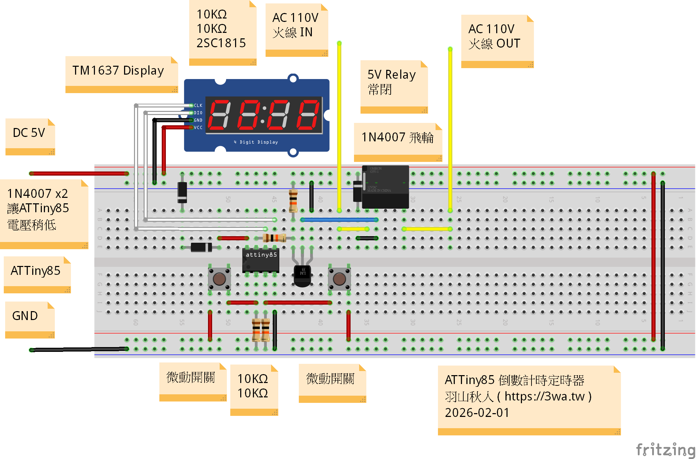
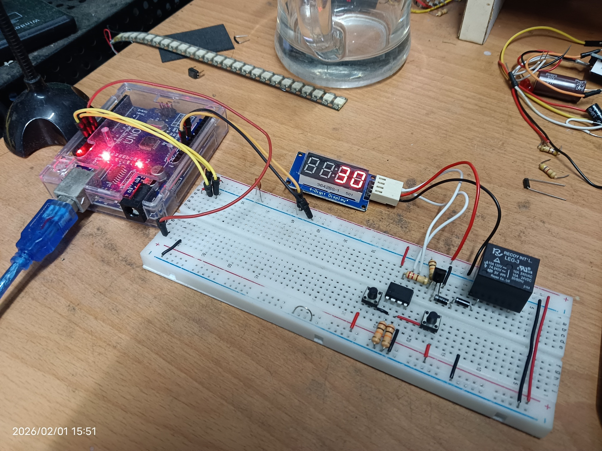

# ATTiny85 簡易倒數計時插座（DIY Relay Timer）

這是一個 **簡單的倒數計時器專案**，用於控制家用 110V 電器（例如電熱毯），讓你可以設定固定時間自動斷電，避免整晚暖被子造成浪費或危險。

---

## 功能特色
- 自行開發的簡易倒數計時器
- 支援常用時間設定，例如 5秒、10秒、20秒、30秒、60秒、180秒、300秒、600秒、1200秒、1800秒、3600秒、7200秒等
- 按鈕操作簡單：
  - **左邊按鈕**：調整倒數計時時間
  - **右邊按鈕**：開始倒數 / 暫停
- 控制 110V 家用電器的火線（安全斷電）
- 適合床上電熱毯或其他小型家電的定時控制

---

## 作者
- 羽山秋人 (https://3wa.tw)

---

## 發佈時間
- 2026-02-01

---

## 使用情境
- 電熱毯定時功能故障，無法自動斷電  
- 睡覺前設定 30 分鐘（1800 秒），倒數結束後自動斷電  
- 避免整晚過熱，省電又安全 🧔

---

## 硬體需求
- 微控制器 **ATtiny85**
- **5V 繼電器模組**（AC 110V 可控）
- **TM1637 4位元七段顯示器**
- **按鈕 2 顆**（設定 / 啟動）
- 電阻 **10KΩ 1/2W ×3**  
- 電阻 **220Ω 1/2W ×1**  
- 二極體 **1N4007 ×1**（作為飛輪二極體）  
- 電晶體 **NPN 2SC1815 ×1**  
- 5V 供電（用 USB 豆腐頭即可）

---

## 電路圖

- 因為這個繼電器是 3V，輸入電源 5V 有點太高，所以串了兩個 1N4007 略微降壓  
- 繼電器的常開腳已被剪掉，看起來好像直接插在 5V 電源，其實並非如此
---

## 影片示範
[參考影片](screenshot/20260201_154724.mp4)

---

## 注意事項
- **高壓危險**：110V 交流電可致命，操作請小心，必要時使用絕緣工具  
- 確保繼電器觸點電流與電壓規格足夠負載  
- 勿讓電熱毯或其他高功率負載超過繼電器規格  

---

## 授權
MIT License

